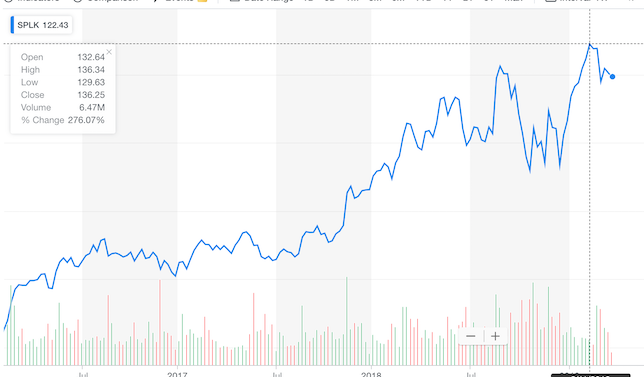
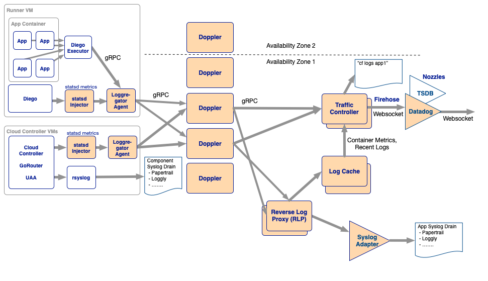

<!-- .slide: class="titlePage" -->

## Logging and Metrics in Cloud Foundry

#### A not at all complete guide to observability in the cloud

Note:
Welcome and Introduction

---

## Why Logging matters

Let's take a look 

 <!-- .element: class="fragment" data-fragment-index="1" -->

Note:
Logging is an industry with lots of potential

---

## What makes a good log

* helpful
* concise
* properly leveled (fatal, error, warn, info, debug, trace)
* context and info about time and origin

Note:
troubleshoot your app at three in the morning when your pager goes off
Notice level
Mapped Diagnostic Context (MDC) support

---

## What do we use logs for

* Troubleshooting of systems <!-- .element: class="fragment fade-in"  -->
* Preemptive monitoring of systems <!-- .element: class="fragment fade-in"  -->
* Regulatory reasons <!-- .element: class="fragment fade-in"  -->
* Source of tansactional data <!-- .element: class="fragment fade-in-then-out"  -->

 <!-- .element: class="fragment fade-in"  -->

Note:
Troubleshooting apps
Regulatory reasons
And sometimes we put important information or events in logs, like whenever a signup occurs (retreat)

--

## Detour: Regulations

* HIPAA, PCI-DSS, NERC, SOX...
* "adequate logging system"
* "audit logs"

Note:
* mention SIEM - security information and event management
* 10.6 Review logs for all system components related to security functions at least daily.

--

## Detour: Regulations

* Mostly not compliant with modern logging systems

 <!-- .element: class="fragment" data-fragment-index="1" -->

---

## Other types of observability data

* Standard Application Logs 
* Exception Logs 
* Structured Logs 
* Tracing logs 
* Events 
* Metrics 

Note:
People came up with some other ways to troubleshoot applications

---

## Why Good Logging matters

* Log storage is difficult <!-- .element: class="fragment fade-in"  -->
* Log transport is difficult <!-- .element: class="fragment fade-in"  -->

Note:
Log storage is expensive
EPS

---

## Logging best practices - Johannes edition

* Never rely on log transport <!-- .element: class="fragment fade-in"  -->
* Be cautious about too much log output <!-- .element: class="fragment fade-in"  -->
* Be cautious about too little log output <!-- .element: class="fragment fade-in"  -->
* encrypt at rest and in motion <!-- .element: class="fragment fade-in"  -->

---

## Logging in Cloud Foundry

Let's talk about loggregator

---

## What is loggregator?

#### logging transport

|             | Logs | Metrics |
| ----------- | ----------- |
| Apps      | yes | yes |
| Platform   | no | yes |

---

## Demo time

Note:
Demo
  1. cf logs
  3. cf log-cache
  4. syslog drain
  2. cf log-stream
  5. apps manager/pcf metrics

---

## Loggregator Architecture

---

---

## Troubleshooting Loggregator

Note:
  * dropped metrics 
  * noisy neighbor
  * log meta

---

## Loggregator History

  1. Stream for all app logs
  3. Addition of metrics
  5. Introdcution of scalable syslog drain system
  4. Move from UDP to gRPC for transport and mTLS
  5. Introdcution of even more scalable syslog drain system

---

## Loggregator Future

Note:
  1. agent based architecture (this is where the industry is moving)
  2. only for logs (mixing metrics and logs is not a great idea)

---

## Thank you

May the Logs be with you

jtuchscherer@pivotal.io
